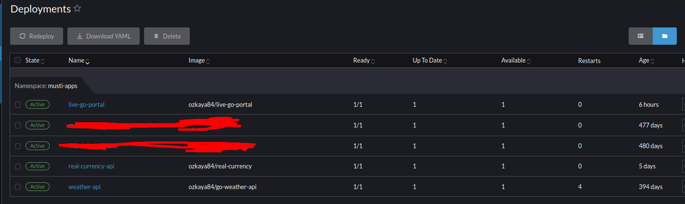

# Live Go Portal - Realtime Weather / Markets

This web application combines multiple microservices to get real time data and fancy frontend with GO-Htmx Websocket and CSS/HTML.


## Code

[mozkaya1@github.com](https://github.com/mozkaya1/live-go-portal)

# Real Time Data

> Below feed is coming from my another go-api microservice which is created by me. It can be adjusted what you need with changing api url/query. Details also on [go-api](https://github.com/mozkaya1/go-api#) repo page.

- Location
- Weather Temp
- Weather Description
- Sunset/Sunrise/Sunset Time Left (Iftar)
- Crypto Market Assets

> And these data is fetched by another go-microservice called real-currency api also [real-currency-api](https://github.com/mozkaya1/real-currency)

- Prime Assets such as Dollar/Euro/Gold

# Installing / Running Services

```bash
git clone https://github.com/mozkaya1/live-go-portal.git
sudo systemctl start docker
cd live-go-portal/
```

Adjust your timezone, refresh time interval value on docker-compose file. Run docker-compose to up all services.

```bash
sudo docker-compose up
```

# Running on Kubernetes/K8/K3/Rancher cluster

Just apply deploy-live-go-portal.yml and deploy-live-go-portal-service.yml file from K8s/ folder..

> P.S: 2 deployments are supposed to be ready already --> ozkaya84/real-currency as named=real-currency-api and ozkaya84/go-weather-api as named=weather-api
> 

```bash
cd K8s
kubectl apply -f deploy-live-go-portal.yml
kubectl apply -f deploy-live-go-portal-service.yml
```
