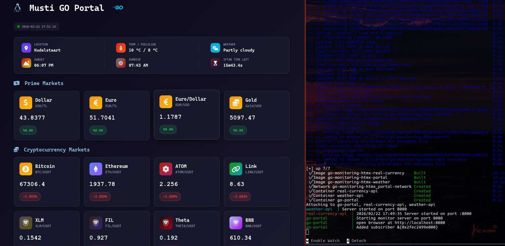

# Live Go Portal - Realtime Weather / Markets

This web application combines multipple microservice to get real time data and fancy frontend with GO-Htmx and CSS.



## Code

[mozkaya1@github.com](https://github.com/mozkaya1/go-monitoring-htmx)

# Real Time Data

> Below feed is coming from my another go-api microservice which is created by me. It can be adjusted what you need with changing api url/query. Details also on [go-api](https://github.com/mozkaya1/go-api#) repo page.

- Location
- Weather Temp
- Weather Description
- Sunset/Sunrise/Sunset Time Left (Iftar)
- Crypto Market Assets

> And these data is fetched by another go-microservice called real-currency api also [real-currency-api](https://github.com/mozkaya1/real-currency)

- Prime Assets such as Dollar/Euro/Gold

# Installing / Running Services

Run docker-compose to up all services.

```bash
sudo docker-compose up
```
